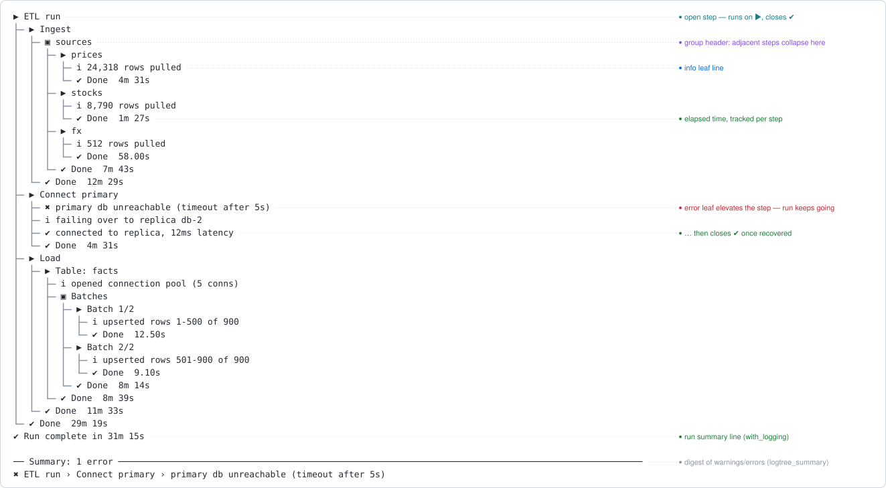

<!-- README.md is generated from README.Rmd. Please edit that file -->

# logtree <a href="https://ivansortino.github.io/logtree/"></a>

<!-- badges: start -->

[](https://github.com/IvanSortino/logtree/actions/workflows/R-CMD-check.yaml)
[](https://app.codecov.io/gh/IvanSortino/logtree)

[Documentation](https://IvanSortino.github.io/logtree/) \|
[GitHub](https://github.com/IvanSortino/logtree)

<!-- badges: end -->

logtree renders nested process execution as a live, colored tree in the
console – tree connectors, status glyphs, and elapsed time per step –
while keeping nesting depth correct even when a step errors partway
through.

<p align="center">


</p>

## Installation

``` r
install.packages("logtree")

# or the development version
# install.packages("pak")
pak::pak("IvanSortino/logtree")
```

## Quick start

``` r
library(logtree)

load_config <- function() {
  log_step("Load config")
  log_info("reading config.yml")
  log_success("validated 12 parameters")
}

fetch_rows <- function() {
  log_step("Fetch rows")
  log_info("requesting from API")
  log_warn("rate limit at 80%")
  log_success("fetched 1,204 rows")
}

pipeline <- function() {
  log_step("Nightly pipeline")
  load_config()
  fetch_rows()
}

with_logging(pipeline())
#> ▶ Nightly pipeline
#> ├─ ▶ Load config
#> │  ├─ ℹ reading config.yml
#> │  ├─ ✔ validated 12 parameters
#> │  └─ ✔ Done  0.00s
#> ├─ ▶ Fetch rows
#> │  ├─ ℹ requesting from API
#> │  ├─ ⚠ rate limit at 80%
#> │  ├─ ✔ fetched 1,204 rows
#> │  └─ ⚠ Done  0.00s
#> └─ ✔ Done  0.01s
#> ✔ Run complete in 0.01s
logtree_summary()
#> 
#> ── Summary: 1 warning ──────────────────────────────────────────────────────────
#> ⚠ Nightly pipeline › Fetch rows › rate limit at 80%
```

`log_step()` is meant to be called from inside a function: the step
auto-closes when the function that opened it returns – normally, early,
or via an uncaught error – so nesting depth never gets stuck out of
sync. (At top level, with no function frame to close on, reach for
`log_open()` / `log_close()` instead.)

The `log_warn()` line turned its own step’s close glyph yellow without
throwing anything, and `logtree_summary()` replayed it with the path it
happened on.

## What else it does

- **Five leaf levels** and a threshold to filter them, globally or per
  sink.
- **Error handling** – `with_logging()` marks every open step failed,
  logs the condition, and rethrows; it never swallows an error.
- **Routing R’s own conditions** – `warning()` and `message()` become
  leaves in the tree instead of stderr noise.
- **Grouping** – adjacent steps sharing a value collapse under one
  header.
- **Call sites and timestamps** – opt-in columns telling you where a
  line came from and when it happened.
- **Themes** – five presets (unicode, ascii, emoji, minimal, ci), every
  glyph, colour and gap overridable.
- **Sinks** – mirror a run to a plain-text or NDJSON file, to a buffer
  you can assert on in tests, or to any function of your own.
- **A `logger` bridge** – route an existing
  [logger](https://daroczig.github.io/logger/) codebase through logtree
  in one call.

## Documentation

- [**Get
  started**](https://IvanSortino.github.io/logtree/articles/logtree.html)
  – the full guide, one section per feature, each with a runnable
  example.
- [**Examples**](https://IvanSortino.github.io/logtree/articles/examples.html)
  – complete end-to-end runs.
- [**Themes
  cookbook**](https://IvanSortino.github.io/logtree/articles/themes.html)
  – every slot and field, and recipes for your own preset.
- [**Recipes**](https://IvanSortino.github.io/logtree/articles/recipes.html)
  – top-level scripts, library authors, scheduled jobs.
- [**Reference**](https://IvanSortino.github.io/logtree/reference/index.html)
  – all exported functions.
- [**Design
  philosophy**](https://IvanSortino.github.io/logtree/articles/design.html)
  – why depth is tied to frames.
